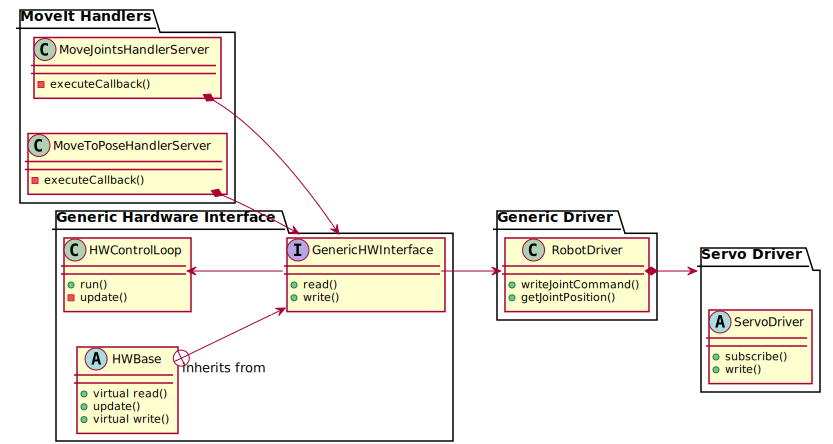

# Generic ROS Driver

## Collaborators

[Christos Gkournelos](https://github.com/cgkournelos)

[Konstantinos Lotsaris](https://github.com/lotsarisk)

## Table of Contents

- [Generic ROS Driver](#generic-ros-driver)
  - [Table of Contents](#table-of-contents)
  - [Introduction](#introduction)
    - [Overview](#overview)
    - [Goals](#goals)
    - [Demos](#demos)
    - [Package exploration](#package-exploration)
  - [Installation](#installation)
    - [Building from Source](#building-from-source)
      - [Requirements](#requirements)
      - [Building procedure](#building-procedure)
  - [How to Configure you Robot](#how-to-configure-your-robot)
    - [Robot Description](#robot-description)
    - [Moveit Semantic Description](#moveit-semantic-description)
    - [Driver Configuration](#driver-configuration)
  - [How to use the Generic ROS Driver](#how-to-use-the-generic-ros-driver)
    - [Simulation](#simulation)
    - [Real Robot](#real-robot)
  - []

## Introduction

### Overview

This is a generic robot driver for Ros Control aimed to server as an example and a template for your robot's. 

In the Default configuration will use my demo robot in a fake execution mode, by passing the command into the state thus fooling the robot agnostic controllers of ros control. 

This is the way for connecting robot's that have no feedback. And also this way you Don't need a real robot for testing. Similar to moveit fake controllers

Then in the write() method will take the Ros command, map it into appropiate robot command and publish it into a ros topic. Although the correct way would be to put your API directly to the write() method

You can configure these mapping process from configuration for ease of use. 
Although they assume that you use pca9685 board to control servos. 
Demo pca9685 drivers subscribe to the command topic, either using rosserial with arduino, or directly from i2c to your pc.

A high level component diagram of the driver can be seen below



Also look at his relevant package!!

[ros_control_boilerplate](https://github.com/PickNikRobotics/ros_control_boilerplate)

Note this files are under license from this project

[generic_hw_control_loop.h](https://github.com/panagelak/ros_control_driver_template/blob/main/generic_driver/generic_hardware_interface/include/generic_hardware_interface/generic_hw_control_loop.h)

[generic_hw_control_loop.cpp](https://github.com/panagelak/ros_control_driver_template/blob/main/generic_driver/generic_hardware_interface/src/generic_hw_control_loop.cpp)

### Goals

A template to start to connect any Robot with ros control!!

### Demos

### Package exploration

A quick overview of the packages

1. **driver_bringup**

    All the launch files and configuration in one package

2. **demo_robot** 
    
    The xacro of the robot + The semantic description for Moveit

    You will need to change these packages to connect your robot + making the appropiate modifications on the driver_bringup, or test with my robot on pseudo-mode (no need for a real robot)

3. **generic_driver**

    a) **generic_hardware_interface**  

    Implements a custom Hardware interface to breach the agnostic robot ros controllers. It registers to the controller manager the Joint handles (for state and command) and then registers the Interfaces.

    Furthermore implements the required read() and write() functions. There you need to put your robot's custom API.

    If you want fake execution e.g for robots that don't have feedback. A parameter is in place where it will pass the command into the state. Thus **assuming perfect execution** and breaching the agnostic controllers. This way you can test the driver without a real robot. And the write() method will publish the **mapped** command into a ros topic.

    b) **generic_robot_driver**

    This package implements a **library** that get's used by the hardware interface in order to read and write to the robot. This way we have seperation between the hardware interface and the robot controllers. 

    THis is the package where you will need to place your robot's custom API

4. **moveit**

    a) **moveit_interface**
        
    Package to place your scripts, cpp nodes and launch files to interact with Moveit

    b) **moveit_action_handlers**

    Holds custom moveit action servers to interact with moveit more flexible from higher level behavior components like FlexBe, Behavior trees, or (multi-client) behavior nodes.
    Documentation : [moveit_action_handlers README](moveit/moveit_action_handlers/README.md)

    c) **moveit_jog_arm** (not yet implemented)

    Moveit package to reactively control the robot by commanding the end effector of the robot with a Twist velocity message

5. **servo_drivers**

    Provides some examples ros drivers to interface with your servos. They subscribe to the **/command** topic that the driver publishes in the write() method and use the Adafruit pwm servo board. Either with rosserial or directly from i2c to your pc (**ros-pwm-pca9685** package)


## Installation

### Building from Source

#### Requirements

- [Robot Operating System (ROS)](http://wiki.ros.org) (middleware for robotics)

It is recommended to use **Ubuntu 18.04 with ROS melodic**, however using Ubuntu 16.04 with ROS kinetic should also work.

#### Building procedure

```bash
# source global ros
source /opt/ros/<your_ros_version>/setup.bash

# create a catkin workspace
mkdir -p catkin_ws/src && cd catkin_ws/src

# Clone the latest version of this repository into your catkin workspace *src* folder.
git clone <repository link>

# Install dependencies of all packages.
sudo apt update -qq
rosdep update
rosdep install --from-paths src --ignore-src -r -y

# build the workspace
catkin_make

# activate the workspace
source devel/setup.bash

```

## How to use the Generic ROS Driver

### Simulation

For simulation we need to start Gazebo, launch the robot description in the parameter server and finally spawn our robot to gazebo. With the gazebo_ros_control plugin we simulate a hardware interface with the gazebo API. For robot's that don't provide feedback it is possible to make them a clone of the simulation by subscribing to the joint_states topic, but i wouldn't recommended it.

```bash
# main launch file for simulation (with moveit + rviz)
roslaunch driver_bringup main_sim.launch

# or

# sim bringup
roslaunch driver_bringup sim_bringup.launch
# moveit - move group
roslaunch moveit_interface moveit.launch
# RViz
roslaunch arm_viz rviz.launch config:=basic
```


## Real Robot

You can test the driver in pseudo-mode, which is the default configuration for robot arms that have no feedback

```bash
# main launch file for simulation (with moveit + rviz)
roslaunch driver_bringup main_real.launch

# or

# sim bringup
roslaunch driver_bringup real_bringup.launch
# moveit - move group
roslaunch moveit_interface moveit.launch
# RViz
roslaunch arm_viz rviz.launch config:=basic
```

Now if you echo the **/command** topic, you should see the mapped command that will get send to the robot. In default this is a **Int32MultiArray** message of **size 16** so we can have implicit information of the location of the servo in the pwm9685 board.

```bash
rostopic echo command
```

Now you can command the robot to go to various joint places with a moveit script

```bash
rosrun moveit_interface pos_exec.py
```

If you are satisfied with the mapping process connect the real robot by e.g starting rosserial 
```bash
roslaunch driver_bringup rosserial.launch
```
Then if you want you can start rosserial from the real_bringup launch file

## How to send Jog Commands - Reactive control

Moveit provides a package to send TwistStamped velocity targets for the end effector of the robot

You can change the config files in the moveit_jog_arm package

Start the jog server

```bash
# real
roslaunch moveit_jog_arm jog_server.launch
# for sim
roslaunch moveit_jog_arm jog_server_sim.launch
```

It requires to change the controllers to joint_group controllers, also it wants a joint_states topic with only the joints of the arm a node that subscribes to /joint_states and punlishes /joint_states/arm has been implemented (get started from the jog_server.launch)

To change the controller (is already loaded)

```bash
rosservice call /controller_manager/switch_controller "
start_controllers: ['joint_group_arm_controller']
stop_controllers: ['arm_controller']
strictness: 2
start_asap: false
timeout: 0.1" 
```

To switch back

```bash
rosservice call /controller_manager/switch_controller "
start_controllers: ['arm_controller']
stop_controllers: ['joint_group_arm_controller']
strictness: 2
start_asap: false
timeout: 0.1" 
```

Now start a teleop node 

### How to use teleop node

```bash
# To start the teleop node
rosrun moveit_interface arm_teleop
```

q, w, e, r, t, y -> +lin.x, +lin.y, +lin.z, +ang.x, +ang.y, +ang.z respectively

a, s, d, f, g, h -> -lin.x, -lin.y, -lin.z, -ang.x, -ang.y, -ang.z respectively

i : increase speed, k : decrease speed, l : stop movement